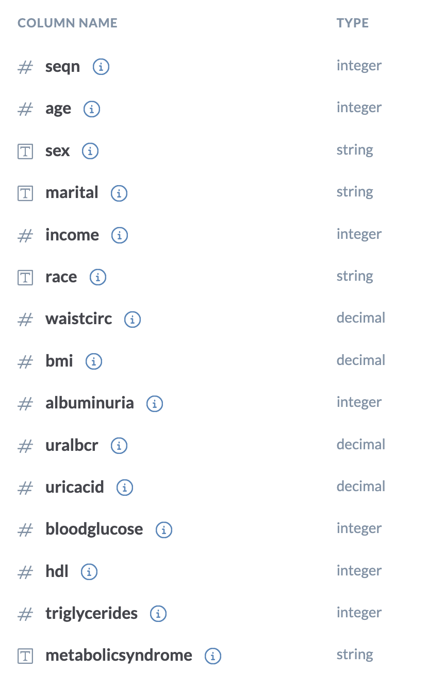
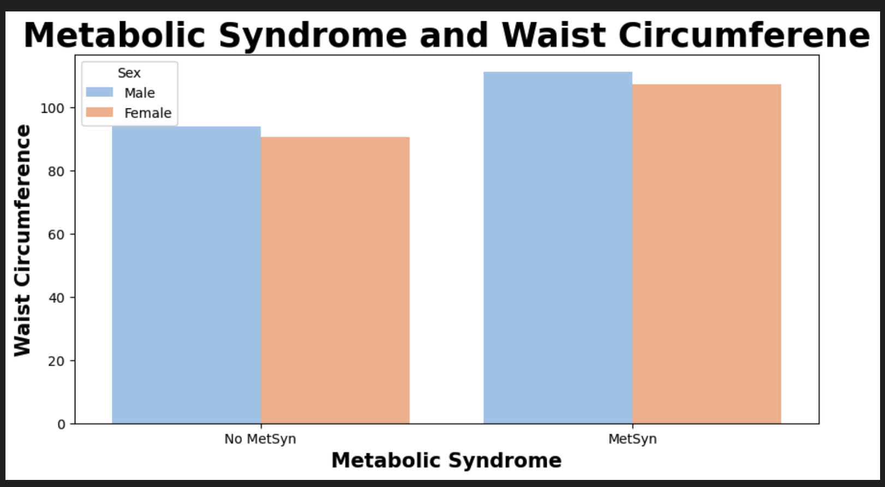
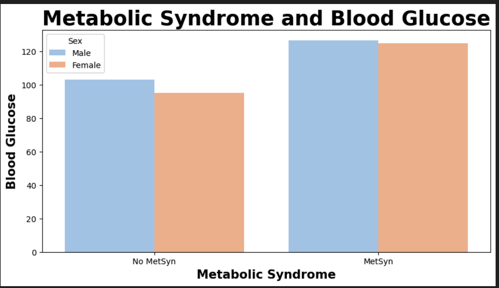
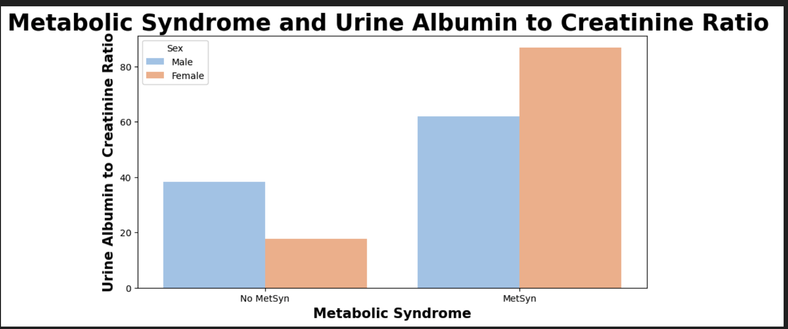

# Healthcare Classification

 Ashley Heinrich

## Overview:

This project was designed to help predict a diagnosis of Metabolic Syndrome based on certain demographic and healthcare data. It examined trends and diagnostic criteria that were linked to metabolic syndrome. Data was preprocessed for machine learning and classification models were used to examine the relationships between variable of interest and the diagnosis. 

Challenges faced with data cleaning include dealing with missing data and whether to impute, delete or some combination of these two. The dataset wasn't large so imputation was selected to prevent excessive loss of data. Background information like a data dictionary for this dataset is missing regarding how they defined metabolic syndrome (NIH ATP III definiton or WHO as an example differ) or just to provide information about columns beyond their datatypes. Assumptions had to be made regarding the units of measurement for many columns. The albuminuria column did not have traditional lab values and was reported by some sort of heirarchy and couldn't be understood. The machine learning models also performed better without it. There were many outliers present in many columns, and while they reflect disease in a patient may have negatively influenced the classification metrics and models. 

**Background of Metabolic Syndrome**

All reputable definitions of metabolic syndrome use some blend of the following criteria; 
1.Insulin resistance/hyperinsulinemia or hyperglycemia
2.Increased waist circumference or waist/hip ratio
3.Dyslipidemia (increased triglycerides)
4.Dyslipidemia- secondary (decreased HDL)
5.Hypertension (elevated blood pressure)**
6.Microalbuminuria (moderately increased albuminuria)

While blood pressure is not in the dataset, high blood pressure is a leading cause of chronic kidney disease, whose diagnosis include elevated levels of some of the values in the data set; albuminuria, UACR and uric acid levels. Both metabolic syndrome and CKD can lead to heart disease and both share many risk factors which co-occur in individuals.

## Data:

Link:'https://docs.google.com/spreadsheets/d/e/2PACX-1vRZCC3KLSaYXzE69EA2IYa6udd-0VbkqlhrT08i0OUD1JX8sU5uIG4IVG5wlvQ8SZnfyKz3FnTuGcux/pub?output=csv'

For this dataset there were originally 2401 rows and 15 columns. 

**Data Dictionary**

## Methods:

Data was initially explored and cleaned. The seqn column was dropped for high cardinality. Missing data was identified. Visualizations were made including histograms, bar plots, heat maps and box plots to further explore data and find any correlations or trends between the features themselves or the diagnosis. 

The target was set as Metabolic Syndrome and the rest initially as features. The Marital, Sex and Race column were all simplified to boolean values to facilitate machine learning. Missing data in the Marital column was imputed with most frequent, Income with mean value and WaistCirc and BMI were imputed with the median to help with the many outliers present. 

Random Forest Classifier and XGBoost were created to examine the relationships between the features and target column. Metrics improved slightly with dropping the Albuminuria column which unfortunately had no definition. The Age column was also simplified to faciliate machine learning. SMOTE was finally used with a Random Forest Classifier and gave the best metrics as it balanced the data.  

## Results: 

**Visualization 1: Metabolic Syndrome and Waist Circumference**

Individuals with Metabolic Syndrome have higher waist circumferences
Males have higher waist circumferences in both categories.
Waist circumference is a diagnostic criteria for Metabolic Syndrome

**Visualization 2: Metabolic Syndrome and Blood Glucose**

Individuals with Metabolic Syndrome have higher blood glucose levels
Males have higher glucose levels in both categories but are much closer to females with Metabolic Syndrome.
Hyperinsulinemia and hyperglcemia (high blood sugar) are a diagnostic criteria for Metabolic Syndrome.

**Visualization 3: Metabolic Syndrome and Triglycerides**

Individuals with Metabolic syndrome have significantly higher triglyceride levels than those without.
Triglycerides are significantly higher in males with metabolic syndrome than females who also have it.
Higher levels in males than females of those without Metabolic Syndrome.
Triglycerides are a type of fat that circulates in the blood. Having lower levels is desired to help prevent heart disease. High levels harden and thicken artery walls.

**Visualization 4: Metabolic Syndrome and HDL**

HDL cholesterol is higher in individuals without Metabolic Syndrome.
Women have higher HDL levels in both categories. More significantly in those without Metabolic Syndrome
This follows the knowledge of higher HDL levels being better for your heart as compared to lower levels. It is considered your 'good' cholesterol with LDL generally being known as the 'bad' one. Your total cholesterol comprises of both HDL and LDL.

**Visualization 5: Metabolis Syndrome and Urine Albumin to Creatinine Ratio** 

There are significantly higher urine albumin/creatinine ratios in patients with metabolic syndrome.
Higher levels in females with metabolic syndrome than males.
Male levels are higher in those without than females.
This is a test to measure the albumin protein levels in urine. It is a quicker 'spot' test that does not require 24 hour collection but does correlate well with 24 hour collections.

## Machine Learning

**Random Forest Classifier**

Random Forest Classifier had an equal performance on test data with XGBoost. To optimize performance, all models were hypertuned. When the Random Forest Classifier was used with SMOTE, the best metrics were achieved. 

**Metrics and Confusion Matrix for Train and Test Data**

The percentage of false negatives is still high, particularly for medical data regarding a diagnosis. Even though it was reduced to 13% percent, to responsibly execute this model accomodations will need to be made to ensure those patients will false negatives don't come to harm. 

## Recommendations:

A recommendation for looking further into retrieving missing data, particularly that in Waist Circumference as it is diagnostic criteria for Metabolic Syndrome. Asking for more data might help as well. Another option would be getting clarity for the meaning of the Albuminuria column results which could allow the Urine Albumin to Creatinine Ratio column to be dropped as they test for the same thing in different ways. This would help decrease the amount of outliers going into the models as that column has many. Implementing more methods that help balance data could also be explored to possibly improve model metrics. 

## Limitation and Next Steps: 

Limitations of this project include the quantities of missing data that had to be imputed and their subsequent effect on the integrity of the data. The lack of access to descriptions in the data dictionary required many assumptions to be made and dropping of what potentially could have been a useful column. General lack of access to any stakeholder to ask questions or for general clarification was limiting. Finally, the limitations of the classification models working with this dataset and that other models may or may not have performed better. 

To move forward with this model, it would be necessary to offer access to medical care to all who were considered negative. This would help cover the 13% that were falsely diagnosed as not having metabolic syndrome, particularly to those adults who are elderly and most susceptible. This could be in the form of a three or six month checkup or physical for example. Education should also be given to all patients regarding signs/symptoms of Metabolic Syndrome and they should be encouraged to report any changes in their health to a medical provider. 
